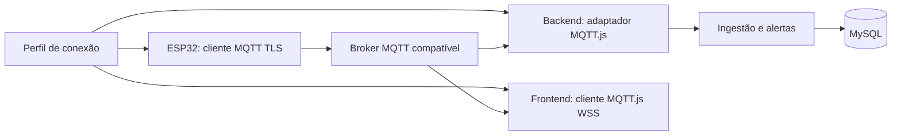

# ADR-001 — Broker MQTT intercambiável

Status: aceito conforme solicitação do proprietário em 04/10/2026.
Escopo implementado: arquitetura e configuração dos testes da Fase 0.
Esta decisão atualiza a escolha de broker e a tarefa T0.2 das referências
originais, preservadas em `docs/referencias/`. As outras fases mantêm a ordem.

## Avaliação das alternativas

Consulta às fontes oficiais em 04/10/2026. Gratuidade do software não inclui
servidor público, energia, domínio ou operação. Limites de planos podem mudar.

| Opção | Gratuidade e limitações | Impacto para este projeto |
|---|---|---|
| Eclipse Mosquitto autogerenciado | Software livre, sem mensalidade de broker; infraestrutura por conta do usuário | Preferido para desenvolvimento local. Configurar TLS, listener WebSocket, usuários, ACLs e persistência. Exposição na internet exige infraestrutura acessível |
| EMQX Cloud Serverless | Cota mensal de 1 milhão de minutos de sessão e 1 GB de tráfego; definir Spend Limit = 0 para consumir somente a cota gratuita | Preferido para demonstração remota gratuita. TLS 8883 e WSS 8084; cadastrar credenciais e permissões no serviço |
| HiveMQ Enterprise com licença Lab | Licença gratuita de desenvolvimento/testes: 25 conexões e 25 mensagens/s; novas licenças válidas por 30 dias; não destinada a produção | Mantido como alternativa local de avaliação industrial. Requer hospedagem, configuração de TLS/WSS e segurança; acompanhar validade da licença |
| HiveMQ Cloud | Novos clusters Serverless indisponíveis desde 30/09/2026; existentes encerram em 31/12/2026. Starter tem avaliação de 15 dias | Continua compatível como opção gerenciada, mas não será pressuposto como nuvem gratuita permanente para este novo projeto |

Fontes: [Mosquitto e licença](https://github.com/eclipse-mosquitto/mosquitto),
[configuração Mosquitto](https://mosquitto.org/man/mosquitto-conf-5.html),
[preços e Spend Limit EMQX](https://docs.emqx.com/en/cloud/latest/price/pricing.html),
[conexão EMQX](https://docs.emqx.com/en/cloud/latest/deployments/port_guide_serverless.html),
[ciclo de vida HiveMQ Cloud](https://docs.hivemq.com/hivemq-cloud/quick-start-guide.html),
[licença Lab HiveMQ](https://docs.hivemq.com/hivemq/latest/user-guide/install-hivemq.html#lab-license).

Como estimativa de capacidade, quatro dispositivos, um backend e um navegador
conectados continuamente por 30 dias consomem 6 × 43.200 = 259.200 minutos
de sessão. Isso cabe na cota de minutos do EMQX; tráfego é uma cota independente,
inclui entrada e saída e cresce com cada assinante. Medir antes da apresentação.

## Diagnóstico da arquitetura existente

O design já prevê MQTT.js, MQTT padrão e Mosquitto alternativo. Não há SDK
exclusivo do HiveMQ nem aplicação consumidora implementada até esta fase.
Portanto, não é necessário reescrever arquitetura, banco ou contratos de negócio.

O acoplamento encontrado estava no setup: um único hostname, caminho WSS
fixo `/mqtt` e documentação que exigia especificamente o HiveMQ Cloud.
Portas já eram configuráveis. URLs independentes resolvem hosts e caminhos
distintos; perfis locais permitem guardar mais de uma configuração.

## Contrato comum obrigatório

- MQTT 3.1.1, usuário/senha, TLS com certificado validado e WSS para navegador.
- QoS 1, retain, LWT, assinaturas wildcard e ACLs equivalentes nos brokers.
- Mesmos tópicos de telemetria e status, payload JSON e timestamps UTC do design.
- MySQL permanece como fonte do histórico. Sem rules engine, banco embutido,
  webhooks ou tópicos proprietários no fluxo essencial.
- Recursos opcionais específicos do fornecedor ficam fora do MVP.



O perfil fornece endpoints e parâmetros; cada componente recebe sua própria
credencial. Um perfil não implica compartilhar senha entre componentes.

## Configuração e chaveamento

Há um broker ativo por execução. Seleção administrativa por variável de
ambiente, com reinício/reconexão coordenados. Não é troca instantânea pelo
usuário do dashboard, failover automático nem publicação em múltiplos brokers.
Essas funções exigiriam coordenação de sessões, duplicação e perda de mensagens
e não fazem parte do pedido implementado nesta fase.

No smoke test, `MQTT_PROFILE=default` (ou ausente) lê `.env`. Outro nome lê
somente `.env.<nome>.local`. Perfis ausentes falham sem recorrer silenciosamente
a outro broker. Variáveis do processo têm precedência: remova overrides MQTT
antigos do terminal antes de alternar arquivos. Todos esses arquivos são ignorados
pelo Git; o `.env` existente foi preservado.

Exemplo de `.env.emqx.local`, a preencher após provisionar o serviço:

```dotenv
MQTT_TLS_URL=mqtts://SEU-HOST:8883
MQTT_WSS_URL=wss://SEU-HOST:8084/mqtt
MQTT_USERNAME=
MQTT_PASSWORD=
MQTT_CA_FILE=
```

Para HiveMQ Cloud use os endpoints do painel (WSS usual: 8884). Para Mosquitto
ou HiveMQ local use os listeners TLS e WSS configurados por você, com host
compatível com o certificado. O frontend hospedado fora da máquina não consegue
acessar um broker restrito a localhost; planejar rede/DNS antes da demonstração.
Porta 8080 de painel administrativo não equivale a um listener MQTT WSS.

```powershell
$env:MQTT_PROFILE='emqx'
npm --prefix backend run check:mqtt
# Quando houver um perfil Mosquitto provisionado:
$env:MQTT_PROFILE='mosquitto'
npm --prefix backend run check:mqtt
# Voltar ao arquivo .env original:
$env:MQTT_PROFILE='default'
```

`MQTT_TLS_URL` e `MQTT_WSS_URL` aceitam hosts distintos e caminho WSS próprio.
As duas URLs devem ser preenchidas juntas. A configuração antiga
`MQTT_HOST`/`MQTT_TLS_PORT`/`MQTT_WSS_PORT` continua funcionando quando ambas
as URLs estiverem vazias. Não colocar usuário/senha ou tokens nas URLs.
`MQTT_CA_FILE` permite uma CA privada confiável, com caminho relativo à raiz;
nunca desabilitar verificação TLS. No navegador, a CA deverá ser confiável no
sistema/navegador; a opção Node.js de CA não é transferível para JavaScript web.

## Impacto nas fases e responsabilidades

| Componente/fase | Adaptação prevista | Impacto |
|---|---|---|
| Fase 0 | Perfil, URLs TLS/WSS, CA opcional, teste independente de fornecedor | Baixo; implementado nesta revisão |
| Backend/Fase 2 | config/mqtt.js consome perfil; serviços recebem payload e tópico do adaptador | Baixo; regras de ingestão, alertas e schema preservados |
| Firmware/Fase 3 | Host, porta, credenciais e CA em config.h; cliente mantém contrato | Baixo em lógica; configurar e regravar cada ESP32 até existir provisionamento remoto |
| Frontend/Fase 4 | Endpoint WSS configurável e credencial de leitura autorizada para a empresa | Moderado; depende da política de autenticação/ACL do broker |
| Operação | Provisionar listeners, certificados, usuários e ACLs equivalentes | Maior esforço no autogerenciado; não é automatizado por MQTT_PROFILE |
| Testes/Fases 2–5 | Repetir testes de contrato para cada broker selecionado | Necessário para afirmar intercambiabilidade ponta a ponta |

O frontend receberá somente configuração pública e credenciais próprias de
leitura, por fluxo autenticado a definir na Fase 4. Nunca receberá `.env` nem
credenciais de ingestão. Credenciais no navegador são visíveis ao usuário;
ACLs no broker, não filtros do JavaScript, devem impedir acesso a outra empresa
e publicação indevida. O JWT da aplicação não autentica automaticamente no
broker. Inicialmente provisionar usuários e ACLs externamente; se futuramente
houver emissão/revogação dinâmica, isolar a API administrativa do fornecedor
em um adaptador separado do cliente MQTT. Revogação MQTT deve acompanhar
desativação de acesso; sair da aplicação deve desconectar o cliente.

Na Fase 3, homologar publicação QoS 1 da biblioteca embarcada antes de adotá-la;
a simples escolha de um broker que aceita QoS 1 não garante que o firmware
publique nesse nível. Este ponto permanece pendente no design original.

## Procedimento de troca futura

1. Provisionar o destino com TLS/WSS, usuários e ACLs; executar o smoke test.
2. Agendar uma pausa, parar produtores/consumidores e atualizar configurações
   em backend, frontend e todos os ESP32. Os mesmos tópicos devem apontar para
   o mesmo broker; mudar somente o backend dividiria o sistema.
3. Iniciar ingestão e assinantes, depois produtores; republicar status online.
4. Verificar telemetria, persistência, LWT e isolamento por empresa.
5. Em falha, restaurar os perfis anteriores de todos os componentes.

Mensagens retidas, sessões, filas e credenciais não migram automaticamente.
Uma troca pode perder leituras em trânsito. QoS 1 não garante entrega entre
brokers diferentes. O histórico já persistido no MySQL é preservado.

## Aceite e evidências

T0.2 passa a exigir um broker compatível selecionado e autenticação/PINGRESP
confirmados em TLS e WSS, sem exigir um fornecedor específico. Banco e demais
critérios da Fase 0 permanecem. Um segundo broker poderá ser homologado depois,
sem bloquear a primeira entrega; compatibilidade projetada não é homologação.

Nesta revisão, `test:mqtt-config` valida URLs independentes, WSS 443,
compatibilidade legada, rejeição de TLS ausente/URL com segredos, configuração
incompleta, perfil ausente e opções de certificado. O smoke test continua
confirmando apenas conexão e ping, sem provar ACL, QoS, LWT ou latência.

Na integração, homologar para cada opção: publicar/receber QoS 1; duplicação
sem duplicar banco; retain/LWT após queda abrupta; reconexão; recusa de senha
inválida, leitura de outra empresa e publicação pelo leitor; latência até 5 s.
Nenhum novo broker foi provisionado nem recebeu credenciais nesta revisão.
